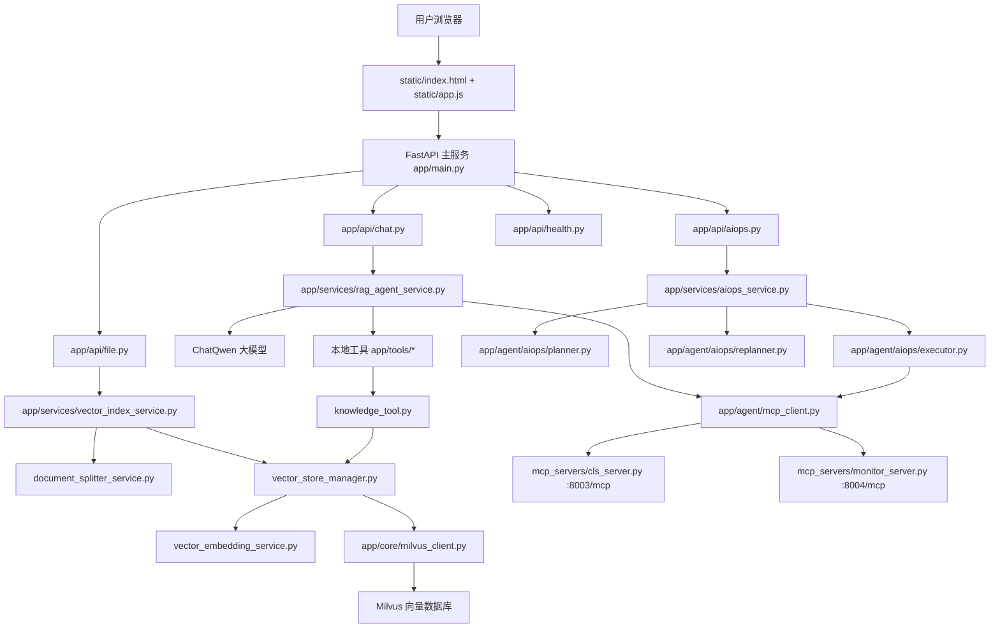

# SuperBizAgent 代码简介

本文用于快速理解 `super_biz_agent_py-release-2026-03-21` 项目的代码结构。它不是逐行源码注释，而是把每个源码文件、配置文件、脚本文件的核心职责、阅读重点和相互关系整理成一份地图，方便后续精读和二次开发。

说明：

- 本文以 Python 项目根目录为基准，即当前文件所在目录。
- 重点覆盖源码、前端代码、MCP 服务、运行脚本、工程配置。
- `.venv/`、`logs/`、`uploads/`、`volumes/`、`__pycache__/`、`*.egg-info/` 属于运行产物或依赖目录，不作为源码逐个讲解。
- `aiops-docs/` 是用于知识库/RAG 的业务文档，不是程序源码，本文在资源文件部分说明其作用。
- `.env` 包含本地密钥和环境变量，不应上传仓库，不在本文展开具体值。

## 1. 项目整体地图

这个项目是一个基于 FastAPI、LangChain、LangGraph、Milvus、MCP 和 Qwen/DashScope 的智能 OnCall Agent 系统。它主要提供三类能力：

1. 对话 Agent：用户输入问题，系统调用大模型并可使用工具回答。
2. RAG 知识库：上传文档后，系统切分、向量化、写入 Milvus，用户提问时检索相关内容辅助回答。
3. AIOps 智能诊断：系统通过 Plan-Execute-Replan 工作流调用日志/监控工具，生成运维诊断报告。

核心调用关系：



## 2. 根目录文件

### `README.md`

核心作用：项目说明文档，包含项目介绍、环境要求、启动方式、接口说明、常见问题。

要点：

- 是运行项目的第一入口。
- 说明了 Windows、Linux/macOS 的启动方式。
- 包含 Docker/Milvus、MCP 服务、FastAPI 服务的启动流程。
- 初学者应先看“安装和启动”“访问服务”“API 接口”“常见问题”。

阅读建议：先泛读，遇到启动问题时回头查。

### `pyproject.toml`

核心作用：Python 项目的包管理和依赖声明文件。

要点：

- 定义项目名、版本、Python 版本要求。
- 声明 FastAPI、LangChain、LangGraph、Milvus、DashScope、FastMCP 等依赖。
- `uv pip install -e .` 能识别项目，主要依赖它。
- 也是判断“当前目录是不是 Python 项目”的关键文件。

阅读建议：重点看 `[project]` 和依赖列表，理解技术栈。

### `uv.lock`

核心作用：uv 依赖锁定文件。

要点：

- 记录依赖的精确版本。
- 保证不同机器安装出来的依赖尽量一致。
- 通常不需要手动编辑。

阅读建议：第一次可以跳过。

### `.python-version`

核心作用：声明项目推荐使用的 Python 版本。

要点：

- 给 pyenv、uv 等工具提供版本提示。
- 这个项目实际运行时你当前使用的是 Python 3.13。

阅读建议：知道它存在即可。

### `.env`

核心作用：本地环境变量文件。

要点：

- 保存 DashScope API Key、Milvus 地址、模型名等本地配置。
- 包含敏感信息，不应提交到 GitHub。
- 由 `app/config.py` 读取。

阅读建议：只在配置环境时查看，不要截图或上传。

### `.env.example`

核心作用：环境变量模板。

要点：

- 给出 `.env` 应该包含哪些变量。
- 不包含真实密钥。
- 适合上传到仓库，方便别人复制后填写自己的配置。

阅读建议：搭建环境时对照使用。

### `.gitignore`

核心作用：告诉 Git 哪些文件不要提交。

要点：

- 应排除 `.env`、`.venv/`、日志、上传文件、运行数据、压缩包、IDE 缓存等。
- 防止把 API Key、虚拟环境、大体积文件误上传。

阅读建议：上传 GitHub 前必须检查。

### `.uvignore`

核心作用：告诉 uv 构建/打包时忽略哪些文件。

要点：

- 和 `.gitignore` 类似，但作用于 uv 的构建上下文。
- 可避免把无关运行文件带入包。

阅读建议：第一次可以跳过。

### `.pre-commit-config.yaml`

核心作用：pre-commit 钩子配置。

要点：

- 用于提交代码前自动执行格式化、检查等动作。
- 体现工程规范，但不是业务主线。

阅读建议：了解工程化时再看。

### `pyrightconfig.json`

核心作用：Pyright 类型检查配置。

要点：

- 配置 Python 静态类型检查范围和规则。
- 帮助编辑器发现类型错误。

阅读建议：改代码时遇到类型提示再看。

### `Makefile`

核心作用：Linux/macOS 下的快捷命令集合。

要点：

- 可能包含初始化、启动、停止、安装依赖、格式化、检查等命令。
- Windows 原生环境通常用 `.bat` 脚本替代。

阅读建议：Windows 学习时可泛读。

### `start-windows.bat`

核心作用：Windows 一键启动脚本。

要点：

- 用来减少手动开多个终端的步骤。
- 通常负责启动 Milvus/Docker Compose、MCP 服务、FastAPI 主服务。
- 如果运行失败，要重点看路径、虚拟环境、端口占用、脚本换行格式。

阅读建议：运行项目时重点看。

### `stop-windows.bat`

核心作用：Windows 停止脚本。

要点：

- 用于停止项目相关服务。
- 通常配合 `start-windows.bat` 使用。
- 有助于清理占用的 9900、8003、8004 等端口。

阅读建议：排查端口占用时重点看。

### `vector-database.yml`

核心作用：Docker Compose 配置文件，用于启动 Milvus 相关服务。

要点：

- 提供 Milvus 向量数据库运行环境。
- 通常包含 Milvus、etcd、MinIO、Attu 等服务。
- 后端连接的 Milvus 默认地址是 `localhost:19530`。

阅读建议：理解 RAG 数据存储时重点看。

### `body.json`

核心作用：接口测试请求体示例。

要点：

- 可能用于 curl 或接口调试。
- 不是核心业务代码。
- 不建议作为必要源码提交。

阅读建议：可作为测试样例参考。

## 3. 应用入口与配置层

### `app/__init__.py`

核心作用：标记 `app` 为 Python 包。

要点：

- 让 `app.main`、`app.api.chat` 等导入路径可用。
- 通常不包含业务逻辑。

阅读建议：知道它用于包初始化即可。

### `app/main.py`

核心作用：FastAPI 主应用入口。

要点：

- 创建 `FastAPI` 应用实例。
- 配置 CORS。
- 注册 `health`、`chat`、`file`、`aiops` 路由。
- 挂载 `static/` 静态文件目录。
- `/` 返回前端首页 `static/index.html`。
- `lifespan()` 在应用启动时连接 Milvus，在关闭时释放连接。

关键流程：

```text
uvicorn app.main:app
→ 创建 FastAPI app
→ 注册接口
→ 挂载前端
→ 连接 Milvus
→ 对外监听 9900 端口
```

阅读重点：

- `lifespan()`
- `app.include_router(...)`
- `app.mount(...)`
- `root()`

### `app/config.py`

核心作用：统一配置管理。

要点：

- 使用 `pydantic-settings` 读取 `.env`。
- 管理应用名、端口、DashScope、Milvus、RAG、MCP 等配置。
- `config = Settings()` 是全局配置对象。
- `mcp_servers` 属性把 8003/8004 MCP 服务组织成 `MultiServerMCPClient` 可用的配置结构。

阅读重点：

- `SettingsConfigDict(env_file=".env")`
- `dashscope_api_key`
- `milvus_host` / `milvus_port`
- `rag_top_k`
- `mcp_servers`

## 4. API 接口层

### `app/api/__init__.py`

核心作用：标记 `app/api` 为接口包。

要点：

- 方便 `app.main` 中导入 `chat`、`health`、`file`、`aiops`。
- 通常没有业务逻辑。

阅读建议：跳过即可。

### `app/api/health.py`

核心作用：健康检查接口。

要点：

- 定义 `GET /health`。
- 返回服务名、版本、运行状态。
- 会调用 `milvus_manager.health_check()` 检查 Milvus 是否可用。

输入：无。

输出：服务健康状态。

阅读重点：

- `health_check()`
- Milvus 健康检查逻辑。

### `app/api/chat.py`

核心作用：聊天相关接口。

要点：

- `POST /api/chat`：普通非流式聊天。
- `POST /api/chat_stream`：流式聊天。
- `POST /api/chat/clear`：清空后端 MemorySaver 中的会话。
- `GET /api/chat/session/{session_id}`：查询后端会话历史。
- 本文件只负责接请求、调用服务、封装响应，不直接处理大模型逻辑。

关键依赖：

- `ChatRequest`
- `ClearRequest`
- `rag_agent_service`
- `EventSourceResponse`

核心调用：

```text
chat()        → rag_agent_service.query()
chat_stream() → rag_agent_service.query_stream()
clear_session() → rag_agent_service.clear_session()
get_session_info() → rag_agent_service.get_session_history()
```

阅读重点：

- 普通返回和 SSE 流式返回的区别。
- 请求参数如何通过 Pydantic 模型解析。

### `app/api/file.py`

核心作用：文件上传和知识库索引接口。

要点：

- `POST /api/upload`：上传 `txt` 或 `md` 文件。
- `POST /api/index_directory`：索引指定目录。
- 上传后会保存到 `uploads/`，再调用 `vector_index_service.index_single_file()` 自动入库。
- 包含文件名清洗、扩展名校验、大小限制。

核心调用：

```text
upload_file()
→ 保存文件
→ vector_index_service.index_single_file(file_path)
```

阅读重点：

- `upload_file()`
- `_sanitize_filename()`
- `_get_file_extension()`

### `app/api/aiops.py`

核心作用：AIOps 智能诊断接口。

要点：

- 定义 `POST /api/aiops`。
- 接收 `session_id`。
- 调用 `aiops_service.diagnose()`。
- 用 SSE 方式流式返回诊断过程和最终报告。

核心调用：

```text
diagnose_stream()
→ aiops_service.diagnose()
→ EventSourceResponse
```

阅读重点：

- `event_generator()`
- 事件流如何包装成 JSON。

## 5. 请求与响应模型层

### `app/models/__init__.py`

核心作用：标记 `app/models` 为模型包。

要点：

- 可用于集中导出模型。
- 通常没有业务逻辑。

阅读建议：跳过即可。

### `app/models/request.py`

核心作用：定义 API 请求体模型。

要点：

- `ChatRequest`：聊天请求。
- `ClearRequest`：清空会话请求。
- `ChatRequest` 使用别名 `Id` 和 `Question`，兼容前端请求字段。

关键字段：

```text
ChatRequest.id       ← JSON 字段 Id
ChatRequest.question ← JSON 字段 Question
ClearRequest.session_id ← JSON 字段 sessionId
```

阅读重点：理解 Pydantic `Field(..., alias=...)`。

### `app/models/response.py`

核心作用：定义 API 响应模型。

要点：

- `ChatResponse`：聊天响应结构。
- `SessionInfoResponse`：会话历史响应结构。
- `ApiResponse`：通用接口响应。
- `HealthResponse`：健康检查响应。

阅读重点：

- `SessionInfoResponse.history` 的结构。

### `app/models/document.py`

核心作用：定义文档分片模型。

要点：

- `DocumentChunk` 表示文档切分后的片段。
- 包含内容、起止位置、分片索引、标题等信息。
- 和 RAG 文档切分、检索结果组织相关。

阅读重点：

- 分片为什么需要 `chunk_index`、`title`、位置等元数据。

### `app/models/aiops.py`

核心作用：定义 AIOps 相关数据模型。

要点：

- `AIOpsRequest`：AIOps 诊断请求，主要包含 `session_id`。
- `AlertInfo`：告警信息模型。
- `DiagnosisResponse`：诊断响应模型。

阅读重点：

- AIOps 接口需要的输入输出结构。

## 6. 核心基础设施层

### `app/core/__init__.py`

核心作用：标记 `app/core` 为核心基础设施包。

要点：

- 通常不包含业务逻辑。
- 方便导入 `milvus_client`、`llm_factory`。

阅读建议：跳过即可。

### `app/core/milvus_client.py`

核心作用：Milvus 底层连接与 collection 管理。

要点：

- 定义 `MilvusClientManager`。
- 创建全局 `milvus_manager`。
- 负责连接 Milvus、创建 collection、创建索引、加载 collection、健康检查、关闭连接。
- collection 名通常是业务知识库集合。
- 字段包括文档 ID、内容、向量、metadata 等。

关键能力：

```text
connect()
_create_collection()
_create_index()
_load_collection()
get_collection()
health_check()
close()
```

被调用位置：

- `app/main.py`
- `vector_store_manager.py`
- `vector_search_service.py`
- `health.py`

阅读重点：

- Milvus 连接参数来自 `config.py`。
- collection schema 如何设计。
- 向量维度与 embedding 模型维度要匹配。

### `app/core/llm_factory.py`

核心作用：大模型实例工厂。

要点：

- 用于统一创建 LLM 实例。
- 目前主线里 `rag_agent_service.py` 和 AIOps 节点直接使用 `ChatQwen` 较多。
- 这个文件体现了后续扩展多模型的意图。

阅读建议：第一次可泛读，后续做模型切换时再精读。

## 6.1 工具辅助层

### `app/utils/__init__.py`

核心作用：标记 `app/utils` 为工具辅助包。

要点：

- 用于组织通用工具类代码。
- 当前主要配合 `logger.py` 使用。
- 通常没有业务逻辑。

阅读建议：跳过即可。

### `app/utils/logger.py`

核心作用：日志工具配置。

要点：

- 统一配置项目日志输出格式、日志级别、日志文件等。
- 方便 API 层、服务层、Agent 层记录运行过程。
- 排查启动失败、Milvus 连接失败、Agent 工具调用失败时，日志非常重要。

阅读重点：

- 日志输出到哪里。
- 日志格式包含哪些字段。
- 是否按日期或大小滚动。

## 7. RAG 对话 Agent 服务层

### `app/services/__init__.py`

核心作用：标记 `app/services` 为服务包。

要点：

- 通常没有业务逻辑。
- 方便服务模块之间导入。

阅读建议：跳过即可。

### `app/services/rag_agent_service.py`

核心作用：对话 Agent 的核心服务。

要点：

- 定义 `RagAgentService`。
- 创建 `ChatQwen` 模型。
- 准备本地工具：`retrieve_knowledge`、`get_current_time`。
- 通过 MCP Client 获取远程工具。
- 使用 `create_agent()` 创建 LangChain Agent。
- 使用 `MemorySaver` 保存同一进程内的会话状态。
- 支持普通回答和流式回答。
- 提供会话历史查询和清空能力。

核心方法：

```text
_initialize_agent()
query()
query_stream()
get_session_history()
clear_session()
```

核心流程：

```text
用户问题
→ HumanMessage
→ agent.ainvoke 或 agent.astream
→ 大模型决定是否调用工具
→ 工具结果回到模型
→ 生成最终答案
```

阅读重点：

- `create_agent(...)` 时传入了哪些工具。
- `thread_id` 如何与 `MemorySaver` 配合保存会话。
- `query()` 和 `query_stream()` 的差别。

### `app/tools/__init__.py`

核心作用：导出本地 Agent 工具。

要点：

- 导出 `retrieve_knowledge`。
- 导出 `get_current_time`。
- 供 `rag_agent_service.py` 和 AIOps 节点统一导入。

阅读建议：看导出关系即可。

### `app/tools/knowledge_tool.py`

核心作用：知识库检索工具。

要点：

- `retrieve_knowledge` 使用 `@tool(response_format="content_and_artifact")` 注册为 LangChain 工具。
- 当 Agent 判断需要查知识库时调用。
- 内部通过 `vector_store_manager.get_vector_store().as_retriever()` 检索相关文档。
- `format_docs()` 将检索到的文档整理成上下文文本。

核心流程：

```text
query
→ Milvus retriever
→ docs
→ format_docs
→ context
```

阅读重点：

- `config.rag_top_k`
- 返回给模型的上下文格式。

### `app/tools/time_tool.py`

核心作用：当前时间查询工具。

要点：

- `get_current_time()` 使用 `@tool` 注册为工具。
- Agent 可在用户询问当前时间、日期相关问题时调用。
- 这是最简单的本地 Tool 示例。

阅读重点：普通函数如何变成 Agent 工具。

## 8. 向量库与文档索引模块

### `app/services/document_splitter_service.py`

核心作用：文档切分服务。

要点：

- 定义 `DocumentSplitterService`。
- 使用 Markdown 标题切分和递归字符切分。
- 根据 `config.chunk_max_size`、`config.chunk_overlap` 控制分片大小。
- 将长文档拆成适合 embedding 和检索的小块。
- 还包含合并过小 chunk 的逻辑，减少碎片。

核心方法：

```text
split_document()
_merge_small_chunks()
```

阅读重点：

- 为什么要 chunk。
- chunk_size 和 overlap 如何影响检索效果。

### `app/services/vector_embedding_service.py`

核心作用：文本向量化服务。

要点：

- 定义 `DashScopeEmbeddings`，继承 LangChain 的 `Embeddings` 接口。
- `embed_documents()` 用于文档入库。
- `embed_query()` 用于用户问题检索。
- 调用 DashScope/OpenAI 兼容接口生成向量。

核心方法：

```text
embed_documents(texts)
embed_query(text)
```

阅读重点：

- embedding 模型名来自 `config.dashscope_embedding_model`。
- 输出向量维度要与 Milvus collection schema 一致。

### `app/services/vector_store_manager.py`

核心作用：LangChain Milvus VectorStore 管理器。

要点：

- 定义 `VectorStoreManager`。
- 初始化 LangChain 的 Milvus VectorStore。
- `add_documents()` 批量写入文档，会自动调用 embedding。
- `delete_by_source()` 删除某个文件来源的旧数据，避免重复索引。
- `get_vector_store()` 给 `knowledge_tool.py` 获取 retriever。

核心方法：

```text
_initialize_vector_store()
add_documents()
delete_by_source()
get_vector_store()
```

阅读重点：

- 它连接了 `milvus_manager` 与 `vector_embedding_service`。
- 它是 RAG 入库和检索之间的桥。

### `app/services/vector_index_service.py`

核心作用：文档索引总调度服务。

要点：

- 定义 `IndexingResult` 和 `VectorIndexService`。
- `index_single_file()` 负责单文件入库。
- `index_directory()` 负责目录批量入库。
- 调用文档切分服务和向量存储管理器。

核心流程：

```text
读取文件
→ 删除旧索引
→ 文档切分
→ 写入向量库
```

阅读重点：

- `index_single_file()`
- 错误处理和统计结果。

### `app/services/vector_search_service.py`

核心作用：手写向量检索服务。

要点：

- 定义 `SearchResult`。
- 定义 `VectorSearchService`。
- `search_similar_documents()` 手动调用 Milvus collection.search。
- 先用 `embed_query()` 将查询转为向量，再在 Milvus 中搜索。
- 当前主线更多使用 `knowledge_tool.py` 中的 retriever，但本文件展示了底层检索方式。

阅读重点：

- `search_params`
- `collection.search(...)`
- L2 距离越小越相似。

阅读建议：理解底层 Milvus 查询时再精读。

## 9. AIOps 智能诊断模块

### `app/services/aiops_service.py`

核心作用：AIOps Plan-Execute-Replan 工作流编排。

要点：

- 定义 `AIOpsService`。
- 使用 `StateGraph(PlanExecuteState)` 构建 LangGraph 工作流。
- 添加三个节点：`planner`、`executor`、`replanner`。
- 设置条件边：如果还有计划则继续执行，否则结束。
- `execute()` 负责流式执行图。
- `diagnose()` 构造固定诊断任务并调用 `execute()`。

核心图：

```text
planner
→ executor
→ replanner
→ executor
→ replanner
→ final response
```

阅读重点：

- `_build_graph()`
- `should_continue()`
- `execute()`
- `diagnose()`

### `app/agent/__init__.py`

核心作用：标记 `app/agent` 为 Agent 相关包。

要点：

- 用于组织 MCP Client 和 AIOps Agent 节点。
- 通常没有业务逻辑。

阅读建议：跳过即可。

### `app/agent/aiops/__init__.py`

核心作用：导出 AIOps 工作流节点和状态。

要点：

- 统一导出 `PlanExecuteState`、`planner`、`executor`、`replanner`。
- 被 `aiops_service.py` 导入使用。

阅读建议：看导出关系即可。

### `app/agent/aiops/state.py`

核心作用：定义 AIOps 工作流状态。

要点：

- `PlanExecuteState` 是 LangGraph 节点之间共享的数据结构。
- 通常包含输入任务、计划步骤、已执行步骤、最终响应。
- `planner`、`executor`、`replanner` 都围绕这个 state 读写数据。

阅读重点：

- 状态字段如何在节点之间流转。

### `app/agent/aiops/planner.py`

核心作用：AIOps 计划生成节点。

要点：

- 定义结构化输出模型 `Plan`。
- 定义 `planner_prompt`。
- `planner()` 根据输入任务生成排查步骤。
- 会参考知识库，也会获取 MCP 工具描述。
- 使用 `llm.with_structured_output(Plan)` 要求模型输出结构化计划。

输入：

```text
PlanExecuteState.input
```

输出：

```text
{"plan": [...]}
```

阅读重点：

- `planner_prompt`
- `Plan`
- `planner()`

### `app/agent/aiops/executor.py`

核心作用：AIOps 步骤执行节点。

要点：

- 读取当前计划步骤。
- 准备本地工具和 MCP 工具。
- 使用 `llm.bind_tools(all_tools)` 让模型具备工具调用能力。
- 执行当前步骤，记录结果到 `past_steps`。
- 可能调用知识库、时间工具、日志 MCP、监控 MCP。

输入：

```text
state.plan
state.past_steps
```

输出：

```text
更新后的 past_steps 和剩余 plan
```

阅读重点：

- 工具绑定。
- 工具调用结果如何加入消息上下文。

### `app/agent/aiops/replanner.py`

核心作用：AIOps 复盘与再规划节点。

要点：

- 定义 `Act` 和 `Response` 两类结构化输出。
- `replanner()` 判断是否继续执行。
- 如果证据不足，更新后续计划。
- 如果证据充分，调用 `_generate_response()` 生成最终报告。
- 是 AIOps 流程中最有决策意味的节点。

输入：

```text
input
plan
past_steps
```

输出：

```text
继续执行的 plan 或最终 response
```

阅读重点：

- `replanner_prompt`
- `response_prompt`
- `replanner()`
- `_generate_response()`

### `app/agent/aiops/utils.py`

核心作用：AIOps 工具描述格式化辅助函数。

要点：

- `format_tools_description()` 将工具列表整理成提示词可读的文本。
- 供 planner/replanner 理解当前有哪些工具可用。

阅读建议：辅助文件，泛读即可。

## 10. MCP 工具扩展模块

### `app/agent/mcp_client.py`

核心作用：主应用连接 MCP 服务的客户端适配层。

要点：

- 使用 `MultiServerMCPClient` 连接多个 MCP 服务。
- 默认读取 `config.mcp_servers`。
- 使用单例 `_mcp_client`，避免重复创建连接。
- `get_mcp_client_with_retry()` 添加工具调用重试拦截器。
- 被 RAG Agent 和 AIOps 节点共同使用。

核心方法：

```text
get_mcp_client()
get_mcp_client_with_retry()
_create_mcp_client()
retry_interceptor()
```

阅读重点：

- MCP 服务配置结构。
- 为什么 8003/8004 工具能被 Agent 获取。

### `mcp_servers/cls_server.py`

核心作用：CLS 日志查询 MCP 服务。

要点：

- 使用 `FastMCP("CLS")` 创建 MCP 服务。
- 监听 `127.0.0.1:8003/mcp`。
- 通过 `@mcp.tool()` 暴露日志相关工具。
- 提供模拟日志、地域、主题、服务查询能力。

主要工具：

```text
get_current_timestamp()
get_region_code_by_name()
get_topic_info_by_name()
search_topic_by_service_name()
search_log()
```

阅读重点：

- `@mcp.tool()` 如何把函数暴露为 MCP 工具。
- `search_log()` 返回什么样的日志证据。

### `mcp_servers/monitor_server.py`

核心作用：监控指标 MCP 服务。

要点：

- 使用 `FastMCP("Monitor")` 创建 MCP 服务。
- 监听 `127.0.0.1:8004/mcp`。
- 提供 CPU 和内存指标查询工具。
- AIOps executor 可调用这些工具获取监控证据。

主要工具：

```text
query_cpu_metrics()
query_memory_metrics()
```

阅读重点：

- 指标数据结构。
- 监控证据如何辅助最终诊断报告。

### `mcp_servers/README.md`

核心作用：MCP 服务说明文档。

要点：

- 说明 MCP 服务的启动方式、端口、工具列表。
- 辅助理解 8003/8004 的作用。

阅读建议：学习 MCP 时配合 `cls_server.py`、`monitor_server.py` 阅读。

## 11. 前端代码

### `static/index.html`

核心作用：前端页面结构。

要点：

- 定义聊天页面的 DOM 骨架。
- 包含左侧历史列表、聊天内容区、输入框、发送按钮、模式切换、上传入口、AI Ops 按钮等。
- 引入 `styles.css` 和 `app.js`。

阅读重点：

- 关键元素的 `id`，因为 `app.js` 通过这些 id 获取 DOM 元素。

### `static/app.js`

核心作用：前端交互主逻辑。

要点：

- 定义 `SuperBizAgentApp`。
- 初始化页面元素和事件。
- 支持普通聊天和流式聊天。
- 调用 `/api/chat`、`/api/chat_stream`、`/api/upload`、`/api/aiops`。
- 使用 `localStorage` 保存左侧历史列表和页面消息。
- 点击历史会话时会先请求后端 `/api/chat/session/{id}`，后端没有则用 localStorage 兜底。
- 处理 SSE/流式响应并实时渲染。

核心方法：

```text
sendMessage()
sendQuickMessage()
sendStreamMessage()
handleFileSelect()
sendAIOpsRequest()
loadChatHistories()
saveChatHistories()
loadChatHistory()
addMessage()
```

阅读重点：

- 前端如何构造请求体。
- 流式响应如何读取。
- localStorage 历史和后端 MemorySaver 历史的区别。

### `static/styles.css`

核心作用：前端样式文件。

要点：

- 控制整体布局、侧边栏、聊天气泡、输入框、按钮、上传遮罩、AIOps 展示等样式。
- 对理解业务逻辑不是必须，但影响用户体验。

阅读建议：前端改样式时再精读。

## 12. 资源与运行数据目录

### `aiops-docs/`

核心作用：AIOps/RAG 示例知识文档。

要点：

- 包含 CPU 高、内存高、磁盘高、服务不可用、响应慢等运维知识。
- 上传或索引后可进入 Milvus，供 `retrieve_knowledge()` 检索。
- 是业务知识来源，不是程序源码。

阅读建议：理解“知识库里有什么”时查看。

### `uploads/`

核心作用：前端上传文件后的保存目录。

要点：

- `/api/upload` 会把文件保存到这里。
- 文件随后被索引进 Milvus。
- 属于运行数据，不建议提交仓库。

### `logs/`

核心作用：运行日志目录。

要点：

- 记录服务运行过程、错误、调试信息。
- 排查问题时有价值。
- 属于运行产物。

### `volumes/`

核心作用：Docker/Milvus 相关持久化数据目录。

要点：

- 可能存放 Milvus、MinIO、etcd 等服务的数据。
- 属于运行产物，不是源码。

### `.venv/`

核心作用：Python 虚拟环境。

要点：

- 存放已安装依赖。
- 不属于项目源码。
- 不应提交 Git。

### `super_biz_agent_py.egg-info/`

核心作用：Python editable 安装生成的包元数据。

要点：

- `uv pip install -e .` 或 `pip install -e .` 后可能生成。
- 不属于业务源码。

## 13. 代码阅读优先级

### 第一优先级：必须精读

这些文件构成项目主干：

```text
app/main.py
app/config.py
app/api/chat.py
app/services/rag_agent_service.py
app/tools/knowledge_tool.py
app/api/file.py
app/services/vector_index_service.py
app/services/document_splitter_service.py
app/services/vector_store_manager.py
app/core/milvus_client.py
app/api/aiops.py
app/services/aiops_service.py
app/agent/aiops/planner.py
app/agent/aiops/executor.py
app/agent/aiops/replanner.py
app/agent/mcp_client.py
```

### 第二优先级：理解核心能力时阅读

```text
app/services/vector_embedding_service.py
app/services/vector_search_service.py
app/tools/time_tool.py
app/models/request.py
app/models/response.py
app/models/aiops.py
app/agent/aiops/state.py
mcp_servers/cls_server.py
mcp_servers/monitor_server.py
static/app.js
```

### 第三优先级：工程化与运行环境

```text
pyproject.toml
uv.lock
vector-database.yml
start-windows.bat
stop-windows.bat
pyrightconfig.json
.pre-commit-config.yaml
.gitignore
.env.example
```

### 第一次可以跳过或泛读

```text
__init__.py 文件
static/styles.css
app/utils/logger.py
app/core/llm_factory.py
mcp_servers 中大量模拟数据细节
```

## 14. 三条主线复习

### 对话主线

```text
static/app.js
→ /api/chat_stream 或 /api/chat
→ app/api/chat.py
→ app/services/rag_agent_service.py
→ LangChain Agent
→ Qwen + tools
→ 前端展示
```

### 知识库主线

```text
static/app.js 上传文件
→ /api/upload
→ app/api/file.py
→ vector_index_service.py
→ document_splitter_service.py
→ vector_embedding_service.py
→ vector_store_manager.py
→ Milvus
→ knowledge_tool.py 检索
→ Agent 回答
```

### AIOps 主线

```text
static/app.js 点击 AI Ops
→ /api/aiops
→ app/api/aiops.py
→ aiops_service.py
→ planner.py
→ executor.py
→ MCP tools
→ replanner.py
→ 最终诊断报告
```

## 15. 适合写进简历的代码能力点

可以提炼成：

1. 基于 FastAPI 构建智能运维 Agent 后端服务，提供对话、知识库上传、AIOps 诊断等接口。
2. 基于 LangChain Agent 接入 Qwen 大模型、本地工具和 MCP 远程工具，实现可工具调用的智能问答。
3. 基于 Milvus 和 DashScope Embedding 构建 RAG 知识库，支持文档切分、向量化、索引入库和语义检索。
4. 基于 LangGraph 实现 Plan-Execute-Replan 运维诊断流程，支持流式返回计划、执行过程和最终报告。
5. 基于 MCP 拆分日志和监控工具服务，实现 Agent 外部工具能力扩展。
6. 前端使用原生 JavaScript 实现聊天交互、流式响应渲染、文件上传和 localStorage 会话展示。

## 16. 后续改造建议

如果你要继续提升项目质量，可以从这些方向入手：

1. 后端会话持久化：将 `MemorySaver` 替换为 SQLite/PostgreSQL/Redis checkpointer。
2. 知识库管理页面：增加已上传文档列表、删除文档、重新索引功能。
3. MCP 工具真实化：把模拟日志/监控数据替换成真实云服务或本地监控系统。
4. AIOps 报告增强：增加证据引用、风险等级、建议动作、导出报告。
5. 测试补齐：为 API、RAG 入库、工具调用、AIOps 工作流增加单元测试和集成测试。
